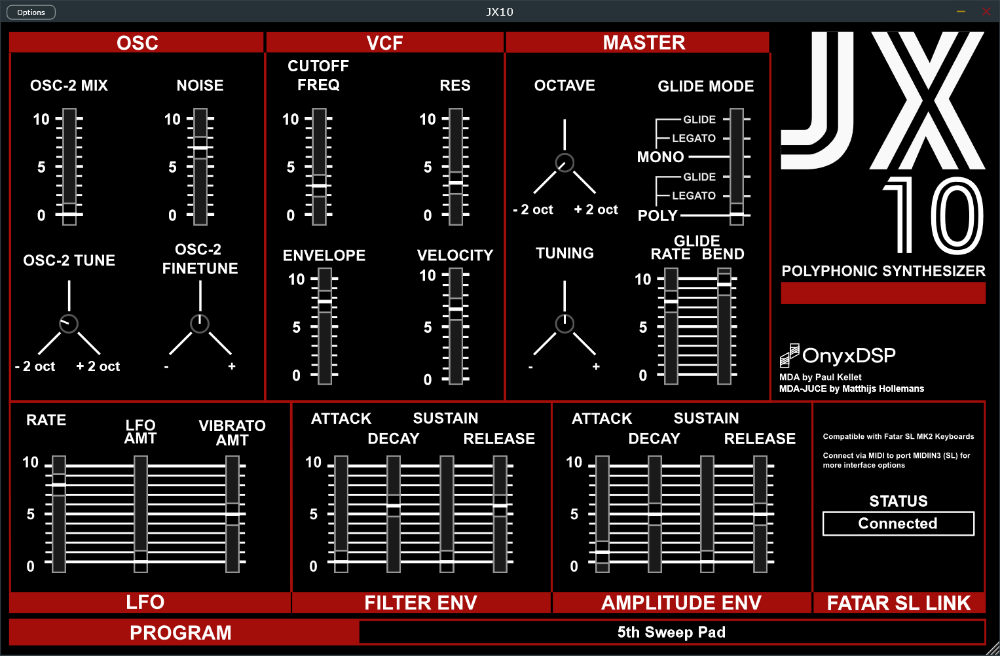
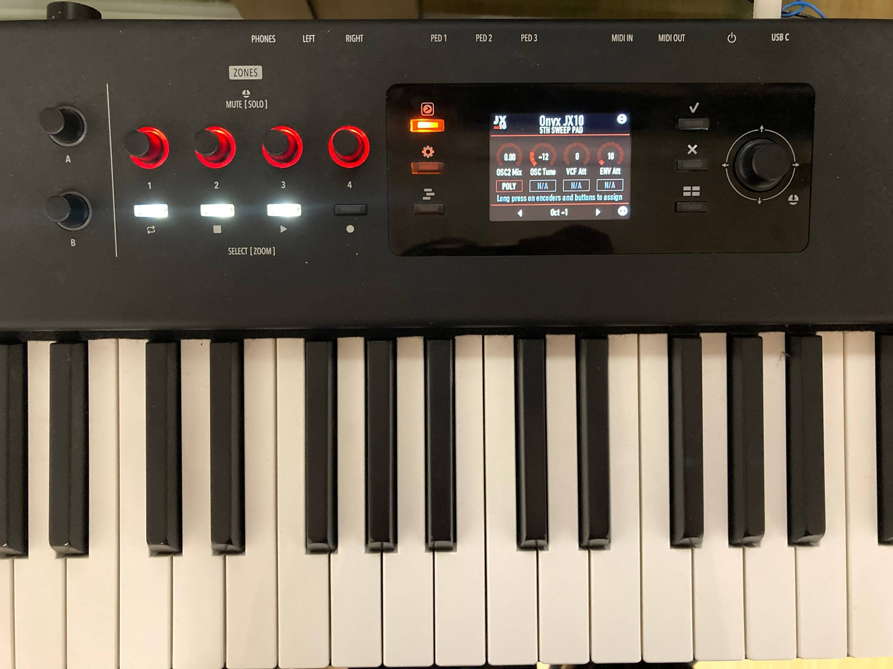
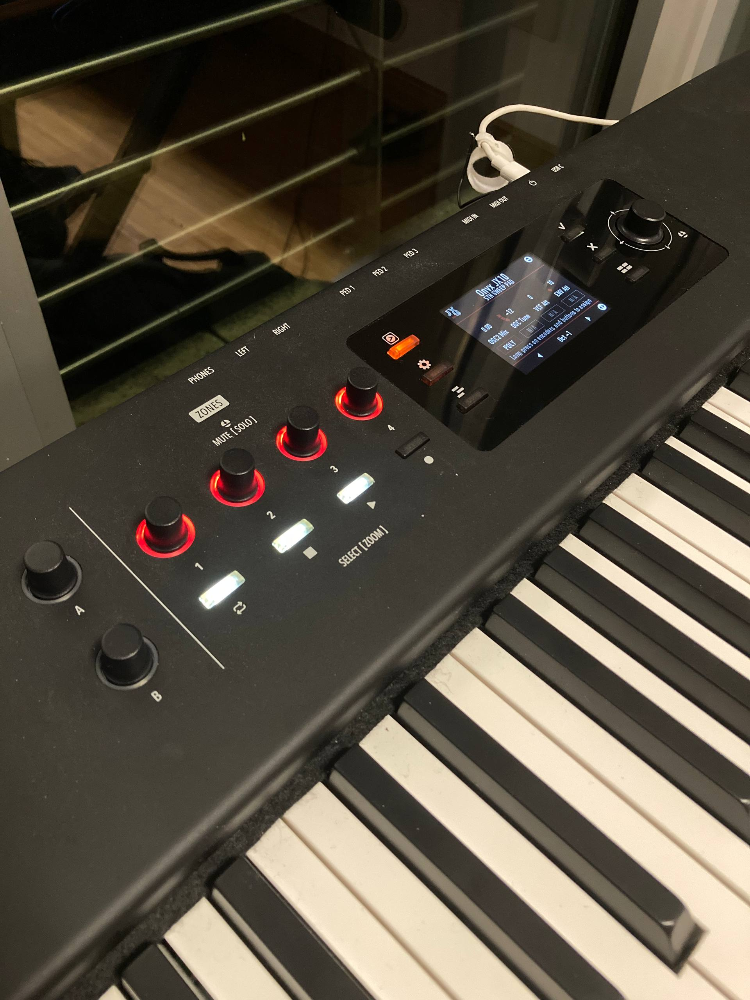
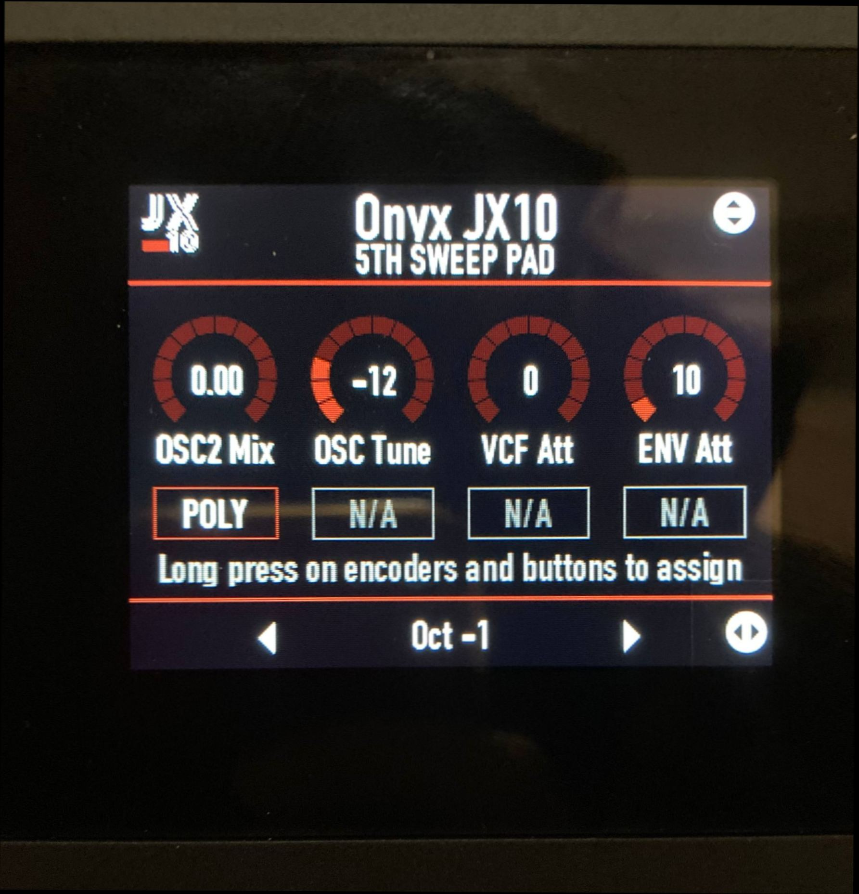
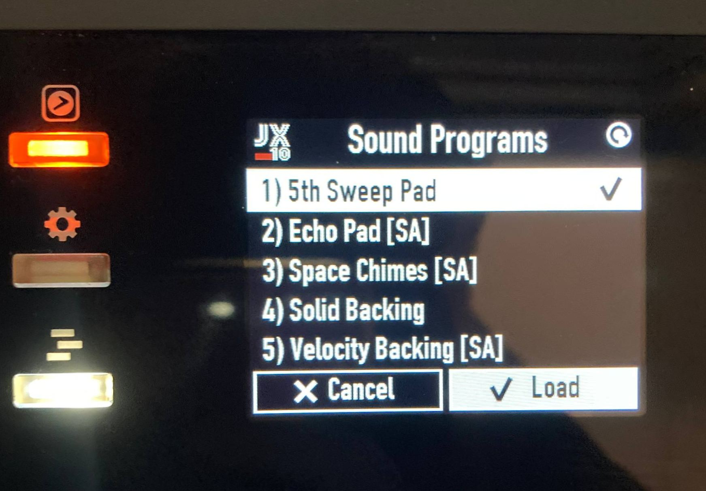

MDA JX10 Plugin adapted for the SL MK2 Keyboard with UI (SL Link)
---

This is an adaptation of the MDA JX10 synthesizer (Paul Kellet) through its JUCE port (mda-juce, M.I. Hollemans), with a custom GUI and integration for the FATAR SL MK2 keyboard (SL Link).

The integration adds a graphical user interface that is displayed on the SL MK2's screen, and maps the keyboard's physical controls to the synthesizer's parameters for real-time manipulation.

Different parameters can be mapped to the keyboard encoders and buttons by simply holding them down for a few seconds, making it easy to customize the control layout.

## Plugin GUI

## SL MK2 Keyboard Integration

Licensing
---

Copyright (c) 2008 Paul Kellett  
Copyright (c) 2021-2025 M.I. Hollemans (JUCE version)  
Copyright (c) 2025 Domenico Stefani, Gregorio Andrea Giudici (SL MK2 integration + GUI)

JUCE VERSION:  
https://github.com/hollance/mda-plugins-juce

LICENSE in [LICENSE.md](LICENSE.md)

